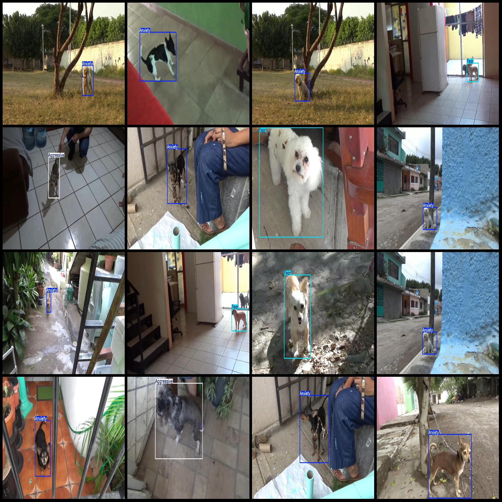
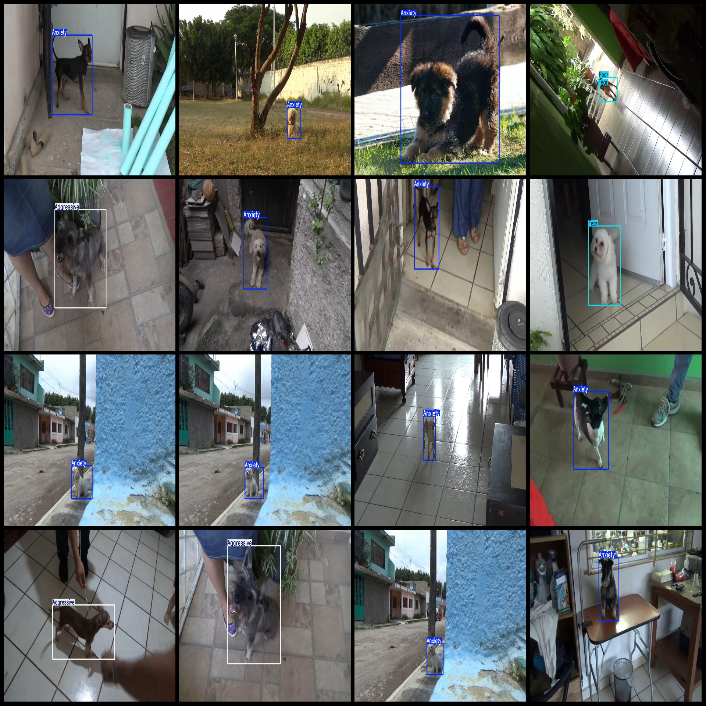

# Dog Emotion Recognition Detection Dataset VOC+YOLO format 1560 images in 3 categories

Dataset format: Pascal VOC format + YOLO format (txt file without segmentation path, only containing jpg images and corresponding VOC format xml files and yolo format txt files)

Number of images (jpg file count): 1560
Number of annotations (xml file count): 1560
Number of annotations (txt file count): 1560
Number of annotation categories: 3
Annotation category names (note that the order of categories in yolo format is not consistent with this, and should be based on the classes.txt in the labels folder): ["Aggressive", "Anxiety", "Fear"]
Each category's number of bounding boxes:
- Aggressive (attacking) bounding boxes = 152
- Anxiety (anxious) bounding boxes = 924
- Fear (fearful) bounding boxes = 491
Total bounding boxes: 1567
Image resolutions: Multiple resolutions, such as 1280x720, 1920x1080, etc.
Using labeling tool: labelImg
Labeling rules: Drawing a rectangle around the category
Important notes: None
Special declaration: This dataset does not guarantee the accuracy of the trained model or weight files
Image previews:
## Image

Here is a pay link on Stripe ( https://buy.stripe.com/3cs8yP7sY87d0vu9AB ). Please contact me lonlonago@foxmail.com after funding $89, and I will send you a complete data files , thank you!

